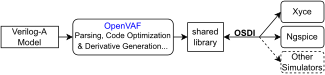

+++
title = "OSDI - Simulator Interface"
description = "OSDI is a simulator independent interface that can revolutionize compact model standardization."
date = 2022-12-01T08:00:00+00:00
updated = 2022-12-01T08:00:00+00:00
draft = false
weight = 470
sort_by = "weight"
template = "docs/page.html"

+++

# OSDI - Simulator Interface

OpenVAF generates shared objects that can be loaded by circuit simulators at run-time. 
To ensure compatibility with a wide variety of simulators SemiMod has developed 
a **simulator independent** interface called OSDI (**O**pen **S**ource **D**evice **I**nterface).
This interface is very flexible and allows efficient integration with a wide variety of different simulators.
As a result it can both support modern harmonic balance solvers and traditional SPICE based engines.
This interface is described in [the OSDI manual](/osdi/osdi_v0p3.pdf).
An implementation that bridges the internal spice API and OSDI has been added to `ngspice`.

<!--  
 
 
 -->
